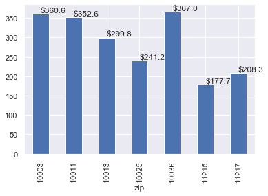
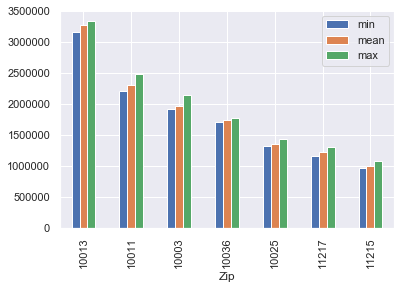
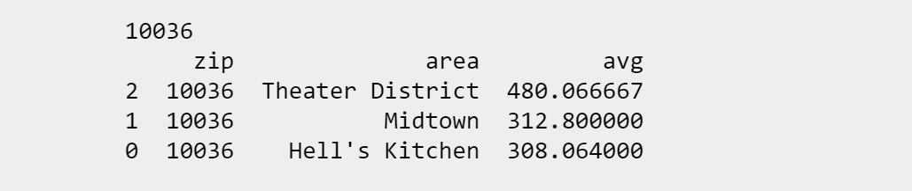
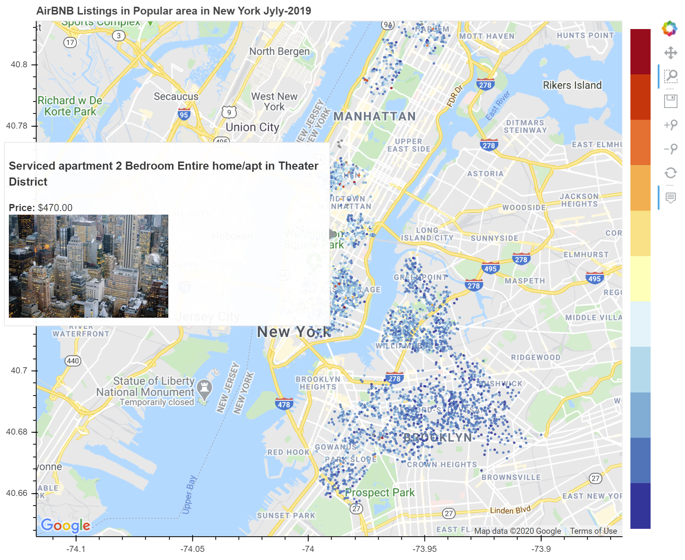

# AirBNB_DataChallege

<h1 style="color:black;">Airbnb Data Challenge</h1>

  * By: Peeti Sriwongsanguan
 
 

 
 
 
<h2 style="color:black;">Problem Statement</h2>

 
The task is to provide an analysis on which zip codes are the most profitable to invest in within New York 
City for two bedroom types. Two datasets, Airbnb and Zillow, are provided for this challenge. 

 * <b>Airbnb</b>: Data contains rental history from 1996-04 to 2019-09 which contains 106 features and 48,895 records providing rental information.
 * <b>Zillow</b>: Data contains monthly information of the property cost within New York City for the past 20 years which contains zip code. The data contains 8946 records and 262 columns. 

<h2 style="color:black;">Data Challenges & Findings</h2>

For Airbnb, There are too many unrelated and unnecessary features and I found many missing values, incorrect zip code format, 
properties not listed in New York.

Zillow data, monthly property costs are in columns which are not a friendly structure for an analysis. 

<h2 style="color:black;">Data Cleaning and Preparing Approaches</h2>

    
<b>Airbnb</b>
<ul>
<li><b>Missing Value</b>: I removed columns that have data less than 80% and filled zero in null values.</li>
<li><b>Remove irrelevant records</b>:</li>
<ul>
<li>I removed records where state is in CA and NJ.</li>
<li>Since our analysis is for 2 bedroom property, so I removed those records that were not 2 bedroom property.</li>
</ul>
<li><b>Format correction</b>:</li>
<ul>
<li>State: some records used state abbreviation, some were written in full.</li>
<li>Zip Code: There are 5 records formatted ZIP+4 and 515 records missing zip code</li>
<li>Price: I remove `$` and , characters.</li>
</ul>
</ul>    

<b>Zillow</b>
<ul>
<li><b>Transpose transformation</b>: I reversed a YYYYMM property cost from column entity to row.</li> 
<li><b>Rename column header</b>: To make it more meaningful, I renamed RegionName to zip code.</li>
<li><b>Change Date to Date format</b></li>
</ul>

<h2 style="color:black;">Packages Required</h2>

* <b>pandas</b>: It provides a fast and friendly way to work with dataframe.
* <b>matplotlib</b>: It provides an easy way to create a visualization.
* <b>bokeh</b>: It is for animated and interactive visualzations.
* <b>re</b>: Regular expression enables me have a faster way to clean data and correct data format.
* <b>numpy</b>: It is the core library for scientific computing.

<h1 style="color:black;">Airbnb May Be More Lucrative Than Traditional Renting</h1>

<b>New York City</b> has been one of the hottest markets for Airbnb, with over 50,000 listings as of July 2019.

A solidly-booked Airbnb rental may be more profitable than renting the same property to a long-term single tenant. 
That’s because you’re usually able to charge more on a nightly basis.In New York City, for example, the average apartment
rents for about <b>`$4000`</b> per month. That is <b>`$48,000`</b> gross income if the tenant signed a 12-month lease. 

What if you went with the Airbnb theory and invest some properties? According to the given AirBnB dataset, 
the average daily rate for an Airbnb rental in is about `$290` and units are occupied an average of 273 days
out of the year (about 75%). If you rented out your Airbnb for `$290` per night for a total 273 nights per year, 
it’s possible to rake in about <b>`$79,000`</b> in gross revenue from the rental. <b>That’s `$31,000` or 65% more than you would make through traditional renting.</b> 

One of the most beautiful things about Airbnb is the conceptualization and execution of a free market. 
Airbnb reservation prices are often much lower than the local rates that a traditional hotel or motel 
demands to keep its books balanced. Often tourists or short-term visitors want to escape from the high 
rates charged by the hotels in the city.

<b>That's why Airbnb is so popular in demand and attracts tourists from all over the world</b>

<i>And the big question is where to invest? How much money you want to put it in? What is the ROI?</i>

<h1 style="color:red;">Insight</h1>

From my findings, I found Top 3 of the zip codes in New York City that are most profitable for rental. All three of them have an average of `$300` and higher a night. 
* <b>10036</b>: <b>Average of `$367` a night</b>
* <b>10003</b>: <b>Average of `$361` a night</b>
* <b>10011</b>: <b>Average of `$353` a night</b>

<i><b>However</b></i>, not all three of them will give you the best ROI.From Zillow dataset, I pulled the most recent year (201601-201706) house price statistics in those zip codes. You can see the lowest average house value and the best average price per night among those zip code is <b>10036:</b> an average of USD367 per night and average sales price of USD1.7 million 
    

    

From the dataset, you know which zip code is the most profitable in New York City. But other question is where is it exactly or another words which area or neiborhood that has the highest average price per night. The table below shows top 3 neighborhoods in 10036 that have the highest average price per night. 

And if you are not familiar with New York City area, the map below shows where the most profitable ROI in Mahattan New Yor City and the city view.

<h1 style="color:black;">Recommendations</h1>

Based on my analysis: <b>Theatre district Area in Zip Code 10036 would give you the best ROI</b> 

If you rent out at an average price of `$367` per night at 75% occupancy rate, you would make `$100k` a year. You would break even after 17.5 years.

However, there are a few number of choices that you can explicitly look at low end properties and more likely to get booked. Besides 10036, my second and third choice for investing would be 10003 and 10011.  

